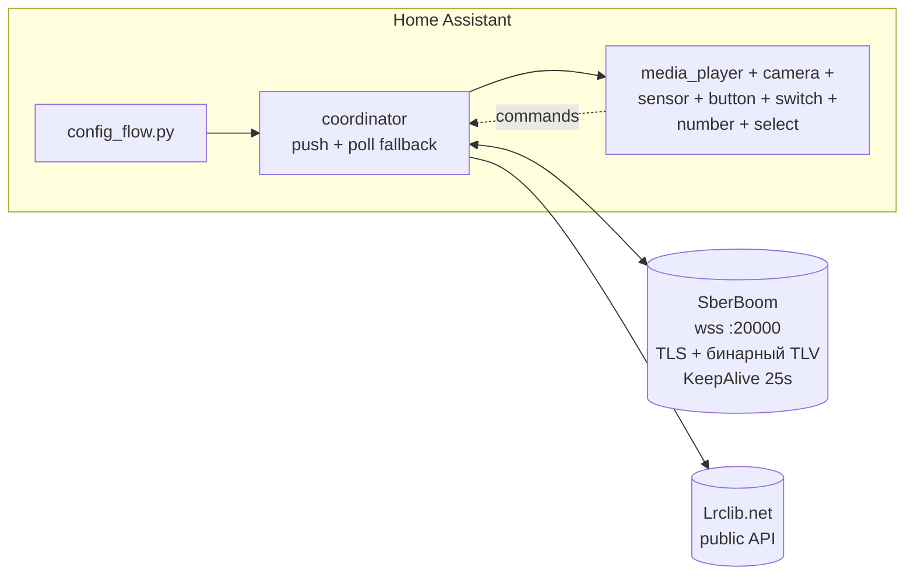

# SBoom (LAN) — Home Assistant Integration

[](https://github.com/hacs/integration)
[](https://github.com/dzerik/sboom_ha/actions/workflows/validate.yml)
[](https://github.com/dzerik/sboom_ha/releases)
[](LICENSE)

Полностью локальное управление умными колонками класса SberBoom из Home Assistant. Никаких облачных токенов, никаких логинов в Sber-аккаунт. Связь с колонкой идёт по локальной сети (WSS на порту 20000), однократная авторизация — нажатием `+` на корпусе колонки.

## Поддерживаемые устройства

- SberBoom Home
- Прочие колонки SberDevices, анонсирующие сервис `_staros._tcp` в локальной сети

## Возможности

### Media Player (`media_player.<name>`)
- ▶️ Play / ⏸ Pause / ⏭ Next / ⏮ Previous
- 🔊 Volume / 🔇 Mute / Volume Up/Down
- ⏩ Seek по позиции трека
- 🔀 Shuffle / 🔁 Repeat (off/playlist/track)
- ❤️ Like / 💔 Dislike (через service-вызовы)
- 🎵 Метаданные трека: title, artist, album, position, duration, cover
- 📡 Push-обновления — никакого поллинга для смены трека
- ⚡ Optimistic-обновления: громкость/mute/play-pause отражаются в UI мгновенно, повторные нажатия Volume Up/Down аккумулируются

### Camera Entity (`camera.<name>_lyrics_na_tv`) — отключена по умолчанию
MJPEG-стрим с **синхронизированными lyrics** в стиле Яндекс.Музыки:

- 🎤 **Караоке-заливка**: текущая строка подсвечивается акцентным цветом по мере пропевания (~5 FPS при воспроизведении)
- 🌫 Blur-обложка фоном с затемнением (кэшируется — CPU щадит)
- ✨ Текущая строка lyrics + следующая (помельче, серая)
- 🎵 Footer с title и artist
- ⏱ Прогресс-бар + время `MM:SS / MM:SS` — обновляются каждую секунду, в том числе между строками
- 📺 Можно отправить на ТВ как изображение через `media_player.play_media`
- 🖼 Snapshot камеры показывает актуальный lyrics-кадр (уважает запрошенный размер)

### Sensors
- `sensor.<name>_lyrics_current_line` — текущая строка lyrics; тик планируется на границу следующей строки (без запаздывания). Для треков без текста — `unknown`, а не `unavailable`
- `sensor.<name>_lyrics` (диагностический, enum) — статус текста, полный текст в attributes
- Подсистемы колонки из GET_STATE: яркость дисплея, будильники, таймеры, активное приложение, персона ассистента, multiroom, тип подключения, спаренные BT-устройства
- `binary_sensor.*`: дисплей, активность, стереопара, подписка, домашняя безопасность, утреннее шоу

### Buttons / Switch / Number / Select
- `button.<name>_play_pause` / `next_track` / `previous_track`
- `button.<name>_like` / `dislike` / `remove_like` / `remove_dislike`
- `button.<name>_bt_pairing` (режим Bluetooth-сопряжения) / `find_remote` (поиск пульта)
- `switch.<name>_shuffle` / `mute`
- `number.<name>_volume`
- `select.<name>_repeat` (off/playlist/track), `select.<name>_playback_speed` (0.5×–2.0×)

### Auto-discovery
Колонка находится автоматически через Zeroconf (`_staros._tcp.local.`) — если mDNS в сети работает. Если в Wi-Fi включена клиентская изоляция (см. [Troubleshooting](#колонка-не-находится-автоматически-mdns--wi-fi-ap-isolation)) — IP вводится вручную в один экран.

## Установка

### Через HACS (рекомендуется)

1. HACS → Integrations → ⋮ (правый верхний) → **Custom repositories**
2. Добавить:
   - Repository: `https://github.com/dzerik/sboom_ha`
   - Category: **Integration**
3. HACS → Integrations → искать **"SBoom (LAN)"** → **Install**
4. Перезагрузить Home Assistant

### Вручную

1. Скачать репо
2. Скопировать `custom_components/sboom_ha/` в `<config>/custom_components/`
3. Перезагрузить Home Assistant

## Настройка

1. **Settings** → **Devices & Services** → **Add Integration** → искать **"SBoom (LAN)"**
   - Если колонка в той же подсети — будет найдена через Zeroconf, появится баннер
   - Иначе — введи IP-адрес вручную
2. После Submit интеграция попросит **нажать `+` на корпусе колонки** (там где обычно показывается громкость)
3. Готово

PIN-токен сохраняется в HA storage. Колонка работает дальше без вашего участия.

## Примеры Lovelace

### Полная карточка плеера

```yaml
type: vertical-stack
cards:
  - type: media-control
    entity: media_player.sberboom_home

  # Karaoke-стрим (если включена camera entity)
  - type: picture-entity
    entity: camera.sberboom_home_lyrics_na_tv
    camera_view: live
    aspect_ratio: 16:9
    show_state: false
    show_name: false
    tap_action:
      action: none
```

### Текущая строка lyrics в markdown-карте

```yaml
type: markdown
content: >
  ### {{ state_attr('media_player.sberboom_home', 'media_title') }}

  *{{ state_attr('media_player.sberboom_home', 'media_artist') }}*

  **{{ states('sensor.sberboom_home_lyrics_current_line') }}**
```

### Отправить lyrics-стрим на ТВ

```yaml
service: media_player.play_media
target:
  entity_id: media_player.living_room_tv
data:
  media_content_id: >-
    /api/camera_proxy_stream/camera.sberboom_home_lyrics_na_tv?token={{ state_attr('camera.sberboom_home_lyrics_na_tv', 'access_token') }}
  media_content_type: image/jpeg
```

### Автоматизация — приглушать музыку при звонке

```yaml
trigger:
  - platform: state
    entity_id: binary_sensor.doorbell
    to: "on"
action:
  - service: media_player.volume_set
    target:
      entity_id: media_player.sberboom_home
    data:
      volume_level: 0.1
```

## Управление из автоматизаций

Все сущности интеграции — стандартные HA-сущности и управляются обычными действиями (actions) в автоматизациях и скриптах:

| Сущность | Действия |
|----------|----------|
| `media_player.<name>` | `media_player.volume_set`, `volume_mute`, `media_play` / `media_pause`, `media_next_track` / `media_previous_track`, `media_seek`, `shuffle_set`, `repeat_set` |
| `switch.<name>_shuffle` / `_mute` | `switch.turn_on` / `turn_off` / `toggle` |
| `number.<name>_volume` | `number.set_value` |
| `select.<name>_repeat` / `_playback_speed` | `select.select_option` |
| `button.<name>_*` (next, like, BT-пейринг, поиск пульта, …) | `button.press` |

Плюс кастомные сервисы `sboom_ha.*` (см. ниже) с таргетингом по `device_id`. Команды применяются optimistic — состояние в UI обновляется сразу, подтверждение приходит push'ем/поллингом.

```yaml
# Пример: ночью замедлять воспроизведение и приглушать громкость
trigger:
  - platform: time
    at: "22:30:00"
action:
  - service: select.select_option
    target: { entity_id: select.sberboom_home_playback_speed }
    data: { option: "0.75" }
  - service: number.set_value
    target: { entity_id: number.sberboom_home_volume }
    data: { value: 20 }
```

## События для автоматизаций

Интеграция выпускает три типа событий в HA bus при изменениях на колонке. Триггерить можно через `platform: event`.

| Событие | Когда | Поля |
|---------|-------|------|
| `sboom_track_changed` | сменился `track_id` (новый трек начал играть) | `track_id`, `title`, `artists`, `album`, `provider`, `previous_track_id`, `entry_id`, `device_id`, `host` |
| `sboom_playback_changed` | тот же track_id, но изменилось `playing` / `shuffle` / `repeat` | `track_id`, `playing`, `shuffle`, `repeat`, `entry_id`, `device_id`, `host` |
| `sboom_volume_changed` | сменилась громкость или mute | `volume_percent`, `muted`, `entry_id`, `device_id`, `host` |
| `sboom_connection_changed` | колонка стала недоступна (3 неудачные reconnect-попытки) или вернулась online | `connected` (bool), `entry_id`, `device_id`, `host` |

```yaml
# Логировать каждый новый трек
trigger:
  - platform: event
    event_type: sboom_track_changed
action:
  - service: logbook.log
    data:
      name: SberBoom
      message: "{{ trigger.event.data.artists | join(', ') }} — {{ trigger.event.data.title }}"

# Подсветить лампу красным когда колонка замьючена
trigger:
  - platform: event
    event_type: sboom_volume_changed
condition:
  - "{{ trigger.event.data.muted }}"
action:
  - service: light.turn_on
    target: { entity_id: light.studio }
    data: { rgb_color: [255, 0, 0] }
```

## Настройки (Options Flow)

`Settings → Integrations → SBoom → Configure`:

| Параметр | Default | Описание |
|----------|---------|----------|
| `volume_poll_interval` | 15 s | Как часто опрашивать громкость/mute |
| `keepalive_interval` | 25 s | WebSocket KeepAlive интервал |
| `availability_threshold` | 3 | После скольки подряд неудачных reconnect entity становятся `Unavailable` |
| `lyrics_enabled` | true | Загружать synced lyrics с Lrclib.net |
| `lyrics_netease_fallback` | true | Резервный источник текстов NetEase, когда Lrclib не нашёл synced-текст |
| `lyrics_offset` | 0.0 s | Сдвиг синхронизации текста (+ раньше / − позже), на media_position не влияет |

Изменения применяются мгновенно (auto-reload).

## Сервисы

| Service | Что делает |
|---------|------------|
| `sboom_ha.refresh_metadata` | Force-fetch текущего трека/состояния (без ожидания poll-цикла) |
| `sboom_ha.reauth` | Запустить переавторизацию (нужно нажать `+` на колонке после вызова) |
| `sboom_ha.bluetooth_device` | Подключить / отключить / удалить спаренное BT-устройство по MAC |

Все сервисы поддерживают `target.device_id`; невалидные вызовы и вызовы без загруженных колонок падают с понятной ошибкой (`ServiceValidationError`), а не игнорируются молча.

## Изменение IP / переавторизация

- **Автоматически**: если mDNS в сети работает, смена IP лечится сама — discovery обновит адрес и перезагрузит интеграцию (в т.ч. для колонок, добавленных вручную: их entry «долечивается» до device-id при первом же discovery).
- **Из Repairs**: если колонка недоступна > 5 минут, в `Settings → System → Repairs` появляется issue с формой нового IP — соединение проверяется до применения, pair-токен сохраняется.
- **Вручную**: `Settings → Integrations → SBoom → ⋮ → Reconfigure`. PIN-токен сохраняется.
- **PIN-токен умер** (factory reset, переустановка) — service `sboom_ha.reauth`, затем нажать `+` на колонке. Автоматического reauth-триггера нет: локальный протокол не отличает отзыв токена от недоступности.

## Удаление интеграции

1. **Settings → Devices & Services → SBoom (LAN)** → меню entry (⋮) → **Delete**.
2. Если интеграция ставилась через HACS и больше не нужна: **HACS → SBoom (LAN)** → ⋮ → **Remove**, затем перезапустить Home Assistant.
3. На колонке ничего чистить не нужно: pair-токен, выданный при нажатии «+», хранится только в Home Assistant и умирает вместе с config entry. Кэш текстов песен (`.storage/sboom_ha_lyrics_*`) удаляется автоматически вместе с entry.

## Включение опциональных entity

Camera и диагностические sensors отключены по умолчанию (это тяжеловесные сущности). Чтобы их включить:

1. **Settings** → **Devices & Services** → найти ваш SberBoom → **N entities**
2. Включить нужные (они помечены как _disabled by default_)

## Иконка интеграции в HA UI

Brand-ассеты лежат прямо внутри интеграции: `custom_components/sboom_ha/brand/{icon,icon@2x}.png` (256×256 + 512×512, заимствованы из `custom_integrations/sberdevices` репо `home-assistant/brands`). Никаких PR в сторонние репозитории не требуется — это новый механизм HA **2026.3+** через [Brands Proxy API](https://developers.home-assistant.io/blog/2026/02/24/brands-proxy-api/): локальные иконки автоматически обслуживаются HA по `/api/brands/integration/sboom_ha/icon.png` и **имеют приоритет** над CDN.

> Note: HACS dashboard может временно показывать пустую иконку для интеграции — это [известная проблема HACS](https://github.com/hacs/integration/issues/5171). В самом Home Assistant (Settings → Integrations, карточка устройства) иконка отображается корректно.

## Зависимости

Устанавливаются Home Assistant'ом автоматически:

- `websockets >= 13.0` — WebSocket-клиент
- `Pillow >= 10.0` — рендер lyrics-кадров для camera entity (≈10 MB)

Lyrics загружаются цепочкой источников: [Lrclib.net](https://lrclib.net/) → NetEase Cloud Music (резерв, отключается в Options) — оба public API, без авторизации и ключей. Приоритет у synced-текста: plain-only результат Lrclib уступает synced-тексту NetEase.

## Известные ограничения

- **Lyrics доступны не для всех треков** — даже цепочка Lrclib → NetEase не покрывает 100% каталога. Для редких/новых треков sensor будет `not_found`.
- **Громкость / mute, изменённые физическими кнопками или голосом**, доезжают до HA с задержкой до `volume_poll_interval` (15 с по умолчанию). Команды из HA отражаются мгновенно (optimistic). Пушит ли колонка изменения громкости — вопрос открытый (research-доки противоречат друг другу); включите DEBUG-лог и поищите `state-push получен: volume=` — если появляется, откройте issue, поллинг можно будет ослабить.
- **Автоматического reauth нет** — протокол не отдаёт различимого признака «токен отвергнут» (см. раздел про переавторизацию).

## Troubleshooting

### Колонка не находится автоматически (mDNS / Wi-Fi AP isolation)

В разделе `Add Integration` колонка не появляется в списке "Discovered", и при попытке поиска через `_staros._tcp` тоже пусто? Скорее всего, ваш роутер блокирует multicast между клиентами.

**Типичные причины:**
- На Wi-Fi включена **AP/client isolation** (изоляция клиентов) — устройства не видят друг друга, mDNS-пакеты не доходят
- HA и колонка в **разных VLAN/SSID** (например, IoT-сеть отдельно от основной)
- Mesh-роутер режет multicast между нодами (часто бывает у TP-Link Deco, Asus AiMesh при некоторых настройках)
- HA в Docker без `host`-network — контейнеру не виден multicast-трафик

**Как проверить с HA-хоста:**
```bash
# Должно показать колонку. Если timeout — mDNS заблокирован
avahi-browse -rt _staros._tcp

# Прямой ping multicast-адреса. Колонка должна ответить
ping -c 3 224.0.0.251

# IP-скан если знаете подсеть. Открытый :20000 = ваша колонка
nmap -p 20000 --open 192.168.1.0/24
```

**Решения (в порядке предпочтения):**

1. **Ввести IP вручную.** `Settings → Devices & Services → Add Integration → SBoom (LAN)` → нет Zeroconf-баннера → форма попросит host. Узнайте IP колонки в роутере (DHCP-leases, обычно по имени `SberBoom-...`) и введите. Дальше — обычный pair-flow с нажатием `+`.

2. **Зафиксировать IP колонки в DHCP-резерве** — чтобы при смене не пришлось переконфигурировать. Если IP всё-таки сменится, у интеграции есть Reconfigure flow (см. ниже).

3. **Выключить AP/client isolation** на роутере (если для вашего use-case это безопасно) — тогда автообнаружение заработает и для будущих устройств тоже.

4. **HA в Docker** — запускать с `--network=host` или включить `homeassistant_zeroconf` репликатор.

После того как колонка добавлена по IP, push-обновления и WSS-связь работают без mDNS — он нужен только для discovery и автоматического реагирования на смену IP.

### Спиннер при добавлении колонки

Проверьте что:
- Колонка в той же подсети, что HA (или маршрутизация между подсетями работает)
- Порт 20000 открыт (`nc -zv <colonka-ip> 20000`)
- HA имеет доступ к интернету (для DNS, если используете hostname)

Включите DEBUG-логи:
```yaml
logger:
  logs:
    custom_components.sboom_ha: debug
```

### "pair_timeout" — кнопка `+` не была нажата

Таймаут — 120 секунд. Просто запустите ещё раз и нажмите быстрее.

### Lyrics не подгружаются

- Lrclib не покрывает все треки. Проверьте через curl: `curl 'https://lrclib.net/api/get?track_name=Sledgehammer&artist_name=Peter+Gabriel'`
- Камера показывает заглушку — значит для текущего трека нет synced lyrics

## Архитектура



Файлы:

```
custom_components/sboom_ha/
├── manifest.json          — метаданные интеграции
├── __init__.py            — entry point, lifecycle, async_setup_entry/unload
├── const.py               — константы протокола и enum'ы команд
├── config_flow.py         — UI добавления (user + zeroconf + reconfigure + reauth)
├── coordinator.py         — DataUpdateCoordinator + supervisor task
├── lyrics_manager.py      — кэш/загрузка/персист текстов песен (выделен из координатора)
├── _entity_base.py        — базовый класс с DeviceInfo
├── helpers.py             — общие утилиты (track_position, lyrics_position, cover_url)
│
│   # Транспорт и парсинг
├── api.py                 — публичный WebSocket-клиент
├── _tlv.py                — бинарный TLV-кодек (varint + length-delimited)
├── _parsers.py            — JSON-парсеры payload'ов трека/состояния
├── _models.py             — dataclasses TrackInfo / SpeakerState
│
│   # Сущности
├── media_player.py        — MediaPlayerEntity (device_class: speaker)
├── camera.py              — Camera с MJPEG караоке-стримом (~5 FPS)
├── sensor.py              — lyrics-сенсоры + декларативные сенсоры подсистем
├── binary_sensor.py       — декларативные бинарные сенсоры подсистем
├── button.py              — Button entities (next/prev/play_pause/like/BT/...)
├── number.py              — Number entity (volume)
├── switch.py              — Switch entities (shuffle, mute)
├── select.py              — Select entities (repeat, playback_speed)
│
│   # Платформы HA-lifecycle
├── diagnostics.py         — Download diagnostics (с redaction токена/host)
├── repairs.py             — Issue speaker_unreachable + flow исправления
├── services.py            — Custom services (refresh_metadata, reauth, bluetooth_device)
├── services.yaml          — структура полей services (тексты — в translations)
├── system_health.py       — Метрики в Settings → System → System Information
├── quality_scale.yaml     — HA Quality Scale: Bronze (done/todo/exempt)
│
│   # Lyrics и рендер
├── lyrics_client.py       — цепочка lyrics-источников (Lrclib → NetEase) с retry
├── image_render.py        — PIL-рендер lyrics-кадров + idle-обложки
│
│   # Ассеты
├── strings.json           — UI-тексты (default)
├── translations/
│   ├── en.json
│   └── ru.json
├── brand/                 — иконка интеграции для HA UI (Brands Proxy API)
│   ├── icon.png           (256×256)
│   └── icon@2x.png        (512×512)
└── fonts/
    └── DejaVuSans.ttf     — шрифт для PIL-рендера
```

## Изменения

См. [CHANGELOG.md](CHANGELOG.md).

## Contributions

Issues и PR приветствуются. Перед PR:
- Code в Python 3.11+ (CI гоняет 3.11–3.13)
- `pip install -r requirements-test.txt`, затем `python -m pytest tests/ -q` (все тесты зелёные) и `ruff check custom_components/ tests/`
- Новая логика — с осмысленными тестами (каждый тест должен ловить реальную регрессию)
- Описать изменения в CHANGELOG.md

## Лицензия

MIT, см. [LICENSE](LICENSE).

## Disclaimer

Этот проект:
- **не аффилирован** с ПАО Сбербанк, SberDevices или любыми их дочерними структурами
- работает **только с теми колонками, которыми владеет конечный пользователь** — авторизация требует физического нажатия кнопки `+` на корпусе устройства
- предоставляется **AS-IS, без гарантий**: SberDevices может в любой момент изменить протокол в новом firmware, и интеграция перестанет работать до обновления адаптера
- **не обходит** никаких технических средств защиты, не использует cloud-токены и не выдаёт себя за официальное приложение

Если вы считаете что этот проект нарушает чьи-то права — откройте issue или напишите автору. Мы обязательно прислушаемся.

## Полезные ссылки
[Telegram](https://t.me/+k_w9uO0h73FkNjJi) c обсуждением этой и других интеграций

Lyrics предоставлены [Lrclib.net](https://lrclib.net/) — open-source community-проект, без аффилиации с Sber.
